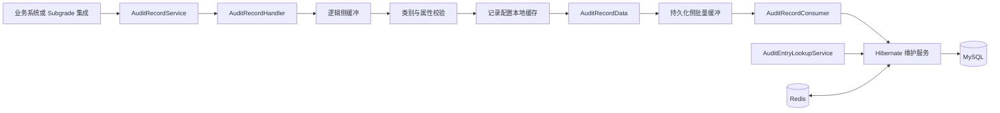
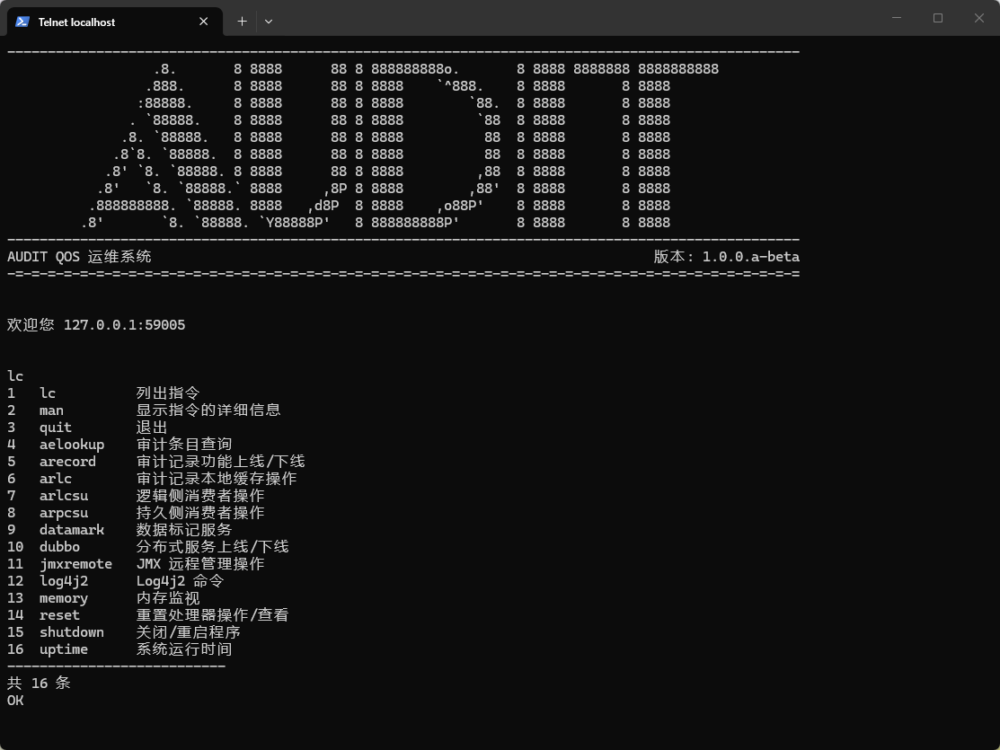
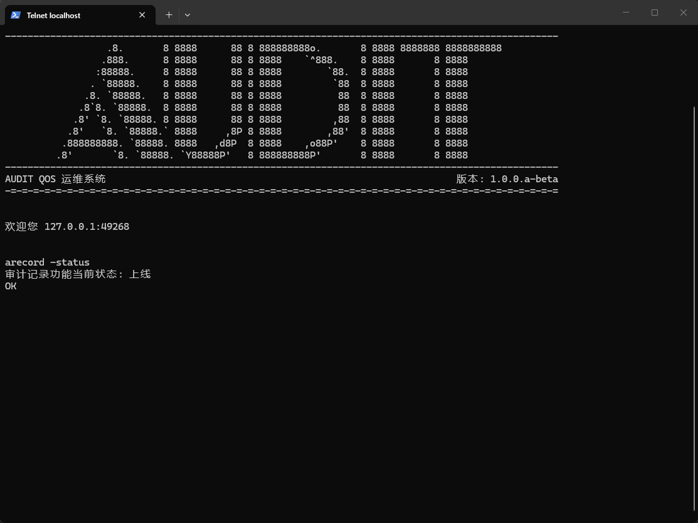

# Audit Introduction - Audit 简介

Audit 是一款基于 Subgrade 构建的审计记录与查询服务，面向需要对系统操作、关键事件和业务上下文进行留痕、追踪与检索的场景，
提供高吞吐量记录、动态属性建模和自由组合查询能力。

审计服务在实际应用中有着广泛的用途，例如以下场景：

- 记录用户登录、数据修改、权限变更等操作，为问题定位和安全追溯提供依据。
- 记录设备状态变化、任务执行结果和系统异常等关键事件，形成可查询的事件时间线。
- 按业务类型定义不同的审计属性，并根据时间、类别和属性值检索符合条件的审计条目。

在上述例子中，虽然记录内容各不相同，但都可以将其抽象为以下过程：

```text
配置审计类别与属性 -> 提交记录请求 -> 校验并构造审计数据 -> 批量持久化 -> 自由查询
```

Audit 以审计类别（AuditCategory）为配置根。每个审计类别可以维护多个审计属性指示器（AuditPropertyIndicator），
用于定义属性 ID、属性类型和默认值。记录请求通过类别 ID 和属性映射描述一次业务事件，服务完成配置校验、类型校验、
默认值填充和主键生成后，将审计条目与属性数据异步写入持久化存储。

Audit 将记录入口处理与持久化处理拆分为两级可配置消费流程。入口侧通过缓冲器和并发消费者吸收记录请求，
持久化侧通过批量消费减少数据库交互；批量持久化失败时，会降级为逐条持久化，以尽可能保留有效审计数据。

查询侧支持组合查询和递归分组查询。使用者可以按照审计类别、审计条目主键、创建时间和动态属性值组织过滤条件，
并通过 AND、OR 逻辑连接符构建嵌套查询表达式。

---

## 国际化（I18N）

您正在阅读的文档是中文文档，您可以在 [wiki](..) 目录下找到其他语言的文档。

You are reading the Chinese document. You can find documents in other languages in the [wiki](..) directory.

- [简体中文](./Introduction.md)
- [English](../en-US/Introduction.md)

## 特性

- 以 AuditCategory 和 AuditPropertyIndicator 描述审计类别及其动态属性结构，支持按业务场景独立配置审计模型。
- 支持字符串、长整型、双精度浮点、布尔和日期属性，并支持在记录未提供属性时使用指示器配置的默认值。
- 使用 Snowflake 分布式服务生成审计条目主键，并在记录处理时写入统一的创建时间。
- 将记录入口处理与持久化处理拆分为两级异步缓冲，支持配置缓冲区容量、消费者线程数、持久化批次和最大空闲时间。
- 定期检查两级缓冲区占用比例，在超过配置阈值时输出告警日志，便于发现消费能力不足或下游阻塞。
- 优先批量持久化审计条目及其属性；批量事务失败时降级为逐条事务持久化，并记录无法保存的数据。
- 提供组合查询，可按照类别、条目主键、创建时间范围和多个动态属性条件查询审计条目。
- 提供递归分组查询，支持使用 AND、OR 连接查询项与子查询组，构建复杂的审计检索条件。
- 使用 Hibernate 持久化业务实体、Redis 缓存实体数据，并通过进程内本地缓存复用审计类别及属性指示器配置。
- 提供定时、固定延迟、固定频率、Dubbo 和禁用型重置器，用于重新加载记录配置并恢复记录处理状态。
- 提供丢弃、日志、组合和原生 Kafka Pusher，用于推送审计记录功能重置事件。
- 通过 Dubbo 暴露维护、记录和查询服务，并提供 Subgrade AuditRecordHandler 集成实现。
- 提供记录上下线、两级消费者监控与调参、本地缓存、自由查询和重置等 Telqos 运维指令。

## 系统架构

Audit 的主要运行链路如下：



记录入口首先校验审计类别、属性定义和属性值类型，并将记录请求转换为 AuditEntry 与 AuditEntryProperty。
持久化侧消费者按照配置的批次和空闲时间聚合数据，在独立事务中写入数据库。查询服务直接基于持久化模型执行组合查询或分组查询。

## 模块

| 模块                | 职责                                                               |
|---------------------|--------------------------------------------------------------------|
| `audit-stack`       | 定义服务契约、领域实体、DTO、异常、缓存、DAO、Handler 和 Service。 |
| `audit-sdk`         | 提供 Bean 映射、WebInput/FastJson 模型、常量和通用校验工具。       |
| `audit-impl`        | 实现 Hibernate、Redis、核心处理器、预设插件和 Telqos 指令。        |
| `audit-node`        | 节点聚合父模块。                                                   |
| `audit-node-all-he` | 提供完整 Hibernate 节点、启动入口、运行配置和可执行发布包。        |
| `audit-api`         | 提供面向外部框架的集成组件，当前包含 Subgrade 审计记录适配。       |
| `audit-distribute`  | 聚合节点发布物，生成最终分发目录。                                 |

## 运行环境

### 核心环境

- Java 8。
- MySQL 与 Hibernate，用于持久化审计类别、属性指示器、审计条目和审计条目属性。
- Redis，用于实体缓存。
- ZooKeeper 与 Dubbo，用于服务注册、服务暴露和远程调用。
- Snowflake 分布式服务，用于生成审计条目主键。

### 可选环境

- Kafka；使用原生 Kafka Pusher 推送审计记录功能重置事件时需要。

## 文档

该项目的文档位于 [docs](../..) 目录下，包括：

### wiki

wiki 为项目开发人员和使用者编写的详细文档，包含不同语言的版本，主要入口为：

1. [简介](./Introduction.md) - 镜像的 `README.md`，与根目录文件内容基本相同。
2. [目录](./Contents.md) - 文档目录。

## 运行截图

Telnet 运维平台指令合集：



在 Telnet 运维平台中查询审计记录功能状态：


